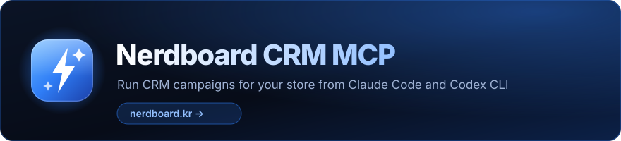
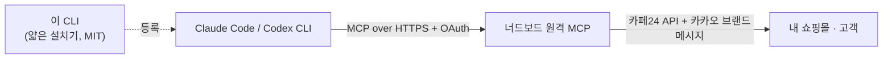

<div align="center">

[](https://nerdboard.kr)

**카페24 쇼핑몰의 카카오 브랜드메시지 CRM 캠페인, Claude Code·Codex CLI에서 말로 시키면 끝나요.**

[](https://www.npmjs.com/package/@nerdlab-dev/crm-mcp)
[](https://www.npmjs.com/package/@nerdlab-dev/crm-mcp)
[](https://github.com/nerdlab-dev/crm/actions/workflows/ci.yml)
[](https://nodejs.org)
[](./LICENSE)

[](https://claude.com/claude-code)
[![Works with OpenAI](https://img.shields.io/badge/Works_with-OpenAI-000000?style=flat-square&logo=data:image/svg%2Bxml;base64,PHN2ZyB3aWR0aD0iNzE2IiBoZWlnaHQ9IjcxNiIgdmlld0JveD0iMCAwIDcxNiA3MTYiIGZpbGw9Im5vbmUiIHhtbG5zPSJodHRwOi8vd3d3LnczLm9yZy8yMDAwL3N2ZyI+PHBhdGggZD0iTTUwOC43NDkgMzE3LjM5OUM1MTYuNzc3IDI4Ny4zMTQgNTA4Ljk5MSAyNTMuODg0IDQ4NS4zODkgMjMwLjI4MkM0NjEuNzg4IDIwNi42ODEgNDI4LjM2IDE5OC44OTUgMzk4LjI3MyAyMDYuOTIzQzM3Ni4yMzEgMTg0LjkyOCAzNDMuMzkgMTc0Ljk1NiAzMTEuMTQ4IDE4My41OTZDMjc4LjkwNiAxOTIuMjM0IDI1NS40NSAyMTcuMjkyIDI0Ny4zNiAyNDcuMzYxQzIxNy4yOTEgMjU1LjQ1MSAxOTIuMjMzIDI3OC45MSAxODMuNTk1IDMxMS4xNDlDMTc0Ljk1NyAzNDMuMzkxIDE4NC45MjcgMzc2LjIzMiAyMDYuOTI0IDM5OC4yNzRDMTk4Ljg5NiA0MjguMzU5IDIwNi42ODMgNDYxLjc4OSAyMzAuMjg0IDQ4NS4zOTFDMjUzLjg4NSA1MDguOTkyIDI4Ny4zMTMgNTE2Ljc3OSAzMTcuNDAxIDUwOC43NUMzMzkuNDQyIDUzMC43NDUgMzcyLjI4NiA1NDAuNzE3IDQwNC41MjUgNTMyLjA3OUM0MzYuNzY3IDUyMy40NDEgNDYwLjIyMyA0OTguMzg0IDQ2OC4zMTMgNDY4LjMxNUM0OTguMzgzIDQ2MC4yMjQgNTIzLjQ0IDQzNi43NjYgNTMyLjA3OCA0MDQuNTI2QzU0MC43MTYgMzcyLjI4NSA1MzAuNzQ3IDMzOS40NDMgNTA4Ljc0OSAzMTcuNDAyVjMxNy4zOTlaTTQ3MC44OTkgMjQ0Ljc3NkM0ODYuODkyIDI2MC43NyA0OTMuNDg4IDI4Mi42MDEgNDkwLjY4NyAzMDMuNDEyTDQxNS41NzcgMjYwLjA0NkM0MTIuNDExIDI1OC4yMTggNDA4LjUwOSAyNTguMjE4IDQwNS4zNDUgMjYwLjA0NkwzMTcuNDAxIDMxMC44MlYyNzcuNTI2QzMxNy40MDEgMjc1LjE5MSAzMTguNjUyIDI3My4wMDUgMzIwLjY3NiAyNzEuODM3TDM4Ny42NDQgMjMzLjE3NEM0MTQuMTc4IDIxOC4zNTMgNDQ4LjM0NiAyMjIuMjIzIDQ3MC45MDEgMjQ0Ljc3Nkg0NzAuODk5Wk0zNTcuODM3IDMxMS4xNDRMMzk4LjI3NSAzMzQuNDkxVjM4MS4xODVMMzU3LjgzNyA0MDQuNTMyTDMxNy4zOTggMzgxLjE4NVYzMzQuNDkxTDM1Ny44MzcgMzExLjE0NFpNMjY0Ljc3NiAyNjkuNjkzQzI2NS4yMDcgMjM5LjMwNSAyODUuNjQ0IDIxMS42NDkgMzE2LjQ1MyAyMDMuMzkzQzMzOC4zIDE5Ny41NCAzNjAuNTA1IDIwMi43NDQgMzc3LjEyNyAyMTUuNTczTDMwMi4wMTQgMjU4LjkzN0MyOTguODQ4IDI2MC43NjQgMjk2Ljg5OCAyNjQuMTQ0IDI5Ni44OTggMjY3Ljc5OFYzNjkuMzQ2TDI2OC4wNjUgMzUyLjY5OUMyNjYuMDQzIDM1MS41MzEgMjY0Ljc3NiAzNDkuMzUzIDI2NC43NzYgMzQ3LjAxN1YyNjkuNjkxVjI2OS42OTNaTTIwMy4zOTEgMzE2LjQ1NEMyMDkuMjQ0IDI5NC42MDggMjI0Ljg1NCAyNzcuOTc4IDI0NC4yNzYgMjY5Ljk5OVYzNTYuNzNDMjQ0LjI3NiAzNjAuMzg0IDI0Ni4yMjYgMzYzLjc2MyAyNDkuMzkyIDM2NS41OTFMMzM3LjMzNyA0MTYuMzY1TDMwOC41MDMgNDMzLjAxM0MzMDYuNDgxIDQzNC4xODEgMzAzLjk2MSA0MzQuMTg4IDMwMS45MzkgNDMzLjAyTDIzNC45NzEgMzk0LjM1N0MyMDguODY4IDM3OC43ODkgMTk1LjEzOCAzNDcuMjYxIDIwMy4zOTEgMzE2LjQ1NFpNMjQ0Ljc3NSA0NzAuOUMyMjguNzgxIDQ1NC45MDYgMjIyLjE4NiA0MzMuMDc1IDIyNC45ODYgNDEyLjI2NEwzMDAuMDk2IDQ1NS42M0MzMDMuMjYzIDQ1Ny40NTcgMzA3LjE2NCA0NTcuNDU3IDMxMC4zMjggNDU1LjYzTDM5OC4yNzMgNDA0Ljg1NlY0MzguMTQ5QzM5OC4yNzMgNDQwLjQ4NSAzOTcuMDIyIDQ0Mi42NzEgMzk0Ljk5NyA0NDMuODM5TDMyOC4wMjkgNDgyLjUwMkMzMDEuNDk1IDQ5Ny4zMjIgMjY3LjMyNyA0OTMuNDUyIDI0NC43NzIgNDcwLjlIMjQ0Ljc3NVpNNDUwLjg5NyA0NDUuOTgyQzQ1MC40NjYgNDc2LjM3MSA0MzAuMDI5IDUwNC4wMjcgMzk5LjIyIDUxMi4yODNDMzc3LjM3MyA1MTguMTM2IDM1NS4xNjggNTEyLjkzMiAzMzguNTQ3IDUwMC4xMDJMNDEzLjY1OSA0NTYuNzM4QzQxNi44MjYgNDU0LjkxMSA0MTguNzc1IDQ1MS41MzIgNDE4Ljc3NSA0NDcuODc3VjM0Ni4zMjlMNDQ3LjYwOSAzNjIuOTc3QzQ0OS42MzEgMzY0LjE0NSA0NTAuODk3IDM2Ni4zMjMgNDUwLjg5NyAzNjguNjU5VjQ0NS45ODVWNDQ1Ljk4MlpNNTEyLjI4MiAzOTkuMjIxQzUwNi40MjkgNDIxLjA2OCA0OTAuODE5IDQzNy42OTcgNDcxLjM5NyA0NDUuNjc2VjM1OC45NDZDNDcxLjM5NyAzNTUuMjkyIDQ2OS40NDggMzUxLjkxMiA0NjYuMjgxIDM1MC4wODVMMzc4LjMzNiAyOTkuMzExTDQwNy4xNyAyODIuNjYzQzQwOS4xOTIgMjgxLjQ5NSA0MTEuNzEyIDI4MS40ODcgNDEzLjczNCAyODIuNjU1TDQ4MC43MDIgMzIxLjMxOEM1MDYuODA1IDMzNi44ODcgNTIwLjUzNiAzNjguNDE1IDUxMi4yODIgMzk5LjIyMVoiIGZpbGw9IndoaXRlIi8+PC9zdmc+)](https://developers.openai.com/codex/cli/)
[](https://modelcontextprotocol.io)


</div>

CRM 캠페인 하나를 보내려면 세그먼트·쿠폰·메시지를 관리자 화면에서 일일이 클릭해야 해요. 너드보드의 호스팅 원격 MCP를 연결하면 AI 에이전트가 대신 해줘요 — **서버 설치도, 내 컴퓨터에 API 키를 둘 일도 없어요**.

이 저장소는 얇은 MIT 라이선스 설치기예요. 모든 CRM 기능은 너드보드가 운영하는 서버에서 실행돼요.

## 무엇을 할 수 있나요

- **카카오 브랜드메시지 발송** — 예약 발송, A/B 테스트, 그리고 장바구니 리마인드·리필 리마인드·가입 환영 같은 상시 자동화 캠페인까지 만들 수 있어요.
- **정밀 타겟팅** — 구매 이력·가입일·장바구니 행동 등으로 고객 세그먼트를 만들고, 발송 전에 대상 모수를 미리 확인해요.
- **카페24 쿠폰 생성** — 쿠폰을 카페24에 바로 발급해요. 과도한 할인을 막는 가드레일이 내장돼 있고, 기존 쿠폰을 연결해 성과만 추적할 수도 있어요.
- **UTM 자동 세팅** — 캠페인 링크에 UTM이 자동으로 붙어서, 발송이 만든 주문까지 추적돼요.
- **소재 이미지 저장소** — 메시지에 쓸 이미지를 업로드해 저장소에 보관하고, 여러 캠페인에서 재사용해요.
- **성과 확인** — 발송·클릭·기여 주문을 대화로 물어보면 돼요.
- **전략 상담** — 우리 몰의 CRM 현황을 불러와서 다음 캠페인을 제안받아요.

## 빠른 시작

**Node.js 20+**와 **Claude Code** 또는 **Codex CLI**가 필요해요. 설정은 2분이면 끝나요.

```bash
npx -y @nerdlab-dev/crm-mcp@latest install
```

두 클라이언트가 모두 설치되어 있다면 하나를 골라 주세요:

```bash
npx -y @nerdlab-dev/crm-mcp@latest install --client claude
npx -y @nerdlab-dev/crm-mcp@latest install --client codex
```

그다음 로그인하세요:

- **Claude Code** — `/mcp`를 실행하고 브라우저에서 로그인을 마쳐요.
- **Codex CLI** — 아래를 실행해요:

  ```bash
  codex mcp login \
    --scopes crm:segment:read,crm:segment:write,crm:coupon:read,crm:coupon:write,crm:campaign:read,crm:campaign:write,crm:campaign:send,crm:strategy:read,ad-asset:read,ad-asset:write \
    nerdboard-crm
  ```

로그인 과정에서 너드보드 워크스페이스와 권한을 직접 고를 수 있어요. 구독이나 쇼핑몰 연동이 아직 없다면 너드보드가 화면에서 안내해 줘요.

이게 전부예요 — 이제 에이전트에게 캠페인을 부탁해 보세요.

## 동작 방식



설치기는 각 제품의 공식 `mcp add` 명령으로 MCP 클라이언트에 `nerdboard-crm`을 등록해요. 모든 CRM 동작은 너드보드가 운영하는 서버에서 실행되고, 서버가 카페24 쇼핑몰과 카카오 브랜드메시지 채널을 대신 다뤄요. 사용하려면 너드보드 계정, 활성 구독, 연동된 카페24 쇼핑몰이 필요해요.

## 보안과 투명성

설치기가 하는 일:

- Codex CLI와 Claude Code가 설치되어 있는지 확인해요.
- `nerdboard-crm` 연결이 이미 있는지 확인해요.
- 제품의 공식 `mcp add` 명령으로 연결을 등록해요.
- 같은 연결이 이미 있으면 아무것도 건드리지 않아요.
- 같은 이름이 다른 URL을 가리키면 덮어쓰지 않고 거부해요.

설치기가 절대 하지 않는 일:

- 쇼핑몰 자격 증명이나 접근 토큰을 읽거나 저장하지 않아요.
- CRM 요청을 로컬에서 중계하거나 처리하지 않아요.
- 너드보드 서버 코드나 캠페인 로직을 포함하지 않아요.
- 기존 MCP 설정을 삭제하거나 덮어쓰지 않아요.

서버 쪽에서는 고객에게 실제로 메시지를 보내는 모든 동작에 대화 중 명시적 확인이 필요해요 — 여러분이 허락하지 않으면 에이전트가 캠페인을 발송할 수 없어요.

모든 푸시와 풀 리퀘스트에서 파일 허용 목록·자격 증명 패턴·금칙어를 검사하는 자동 공개 콘텐츠 검사가 실행돼요.

## 수동 설치

Claude Code:

```bash
claude mcp add --transport http --scope user nerdboard-crm https://nerdboard.kr/mcp
```

Codex CLI:

```bash
codex mcp add nerdboard-crm --url https://nerdboard.kr/mcp
```

원격 MCP를 지원하는 다른 클라이언트(Cursor 등)는 URL을 직접 등록하면 돼요:

```text
https://nerdboard.kr/mcp
```

## 개발

```bash
npm test
npm run check
npm run check:public
npm pack --dry-run
```

## 라이선스

이 저장소의 CLI 소스는 [MIT 라이선스](./LICENSE)예요. 너드보드 서비스와 원격 MCP 서버는 별도의 서비스 약관을 따라요.

## 상표

OpenAI와 Codex는 OpenAI의 상표예요. Claude와 Claude Code는 Anthropic, PBC의 상표예요. 카페24(Cafe24)는 카페24 주식회사의 상표예요. 카카오(Kakao)는 주식회사 카카오의 상표예요. 모든 상표는 호환성을 설명하기 위해서만 사용했어요. 이 프로젝트는 독립 프로젝트이며 위 회사들과 제휴·보증·후원 관계가 없어요.

---

<p align="center"><a href="https://nerdboard.kr">너드보드</a>가 만들었어요</p>
